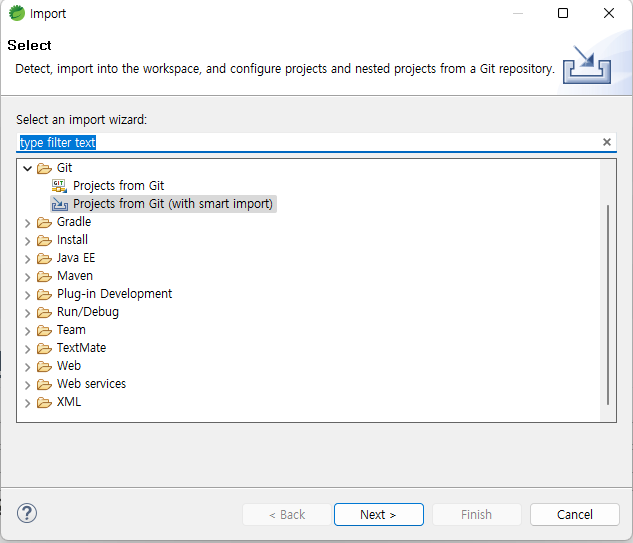
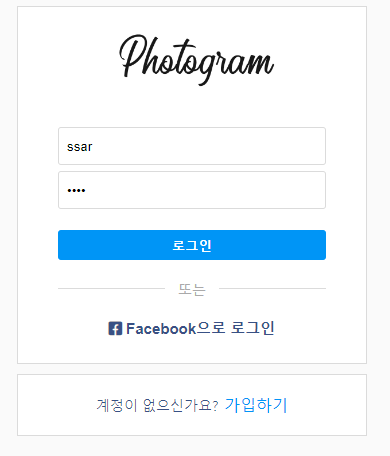
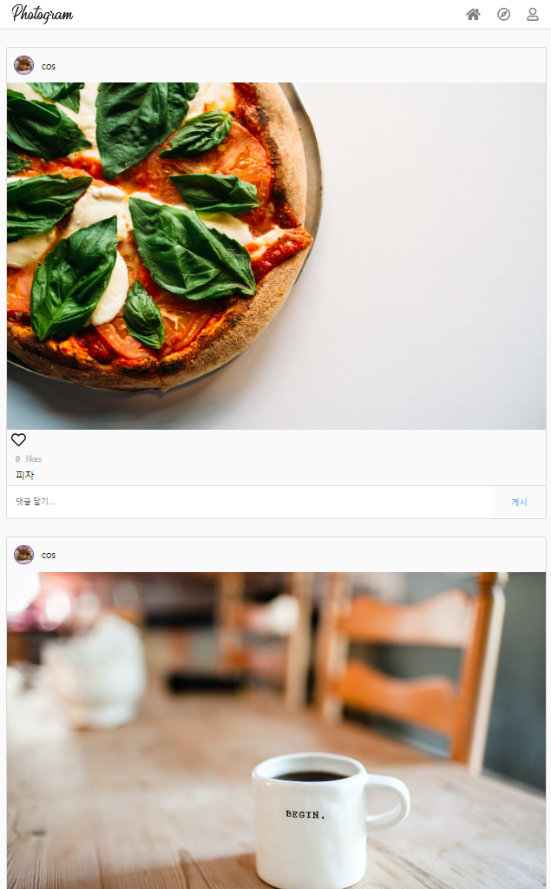

# 포토그램 - 인스타그램 클론 코딩 과제를 위한 깃헙

### 해당 프로젝트의 https 주소를 복사하세요
- https://github.com/easyup-class/Springboot-Photogram-Test.git

### STS 툴에서 import -> git clone 을 이용하여 다운 받으세요


### 해당 프로젝트 특징
- 인메모리 데이터베이스 H2를 사용합니다. 
- 더미데이터가 추가되어 있습니다. 

```text
ssar유저 비번 1234, cos유저 비번 1234
```

```text
ssar유저, cos유저가 서로 맞팔 상태
```

```text
ssar유저 사진 4장 업로드 상태, cos유저 사진 3장 업로드 상태
```

### 해당 프로젝트를 다운받아서 바로 실행하면 로그인 화면이 나옵니다. ssar, 1234로 로그인하세요.


### 로그인이 완료되면 아래와 같이 더미가 추가되어 있는 것을 볼 수 있습니다.



### 사진을 업로드하면, 프로젝트 내부에 upload 폴더에 저장되게 설계되어 있습니다.